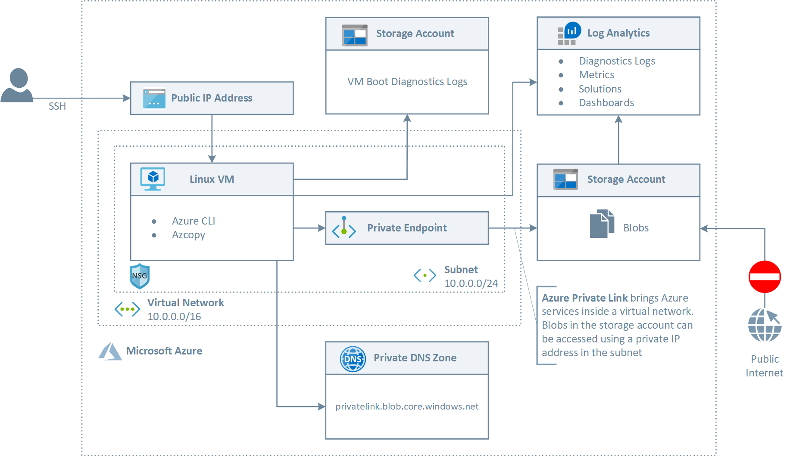
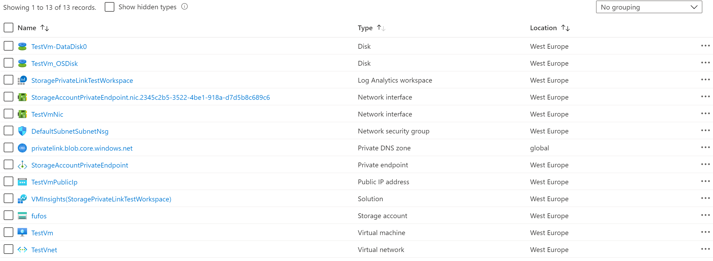
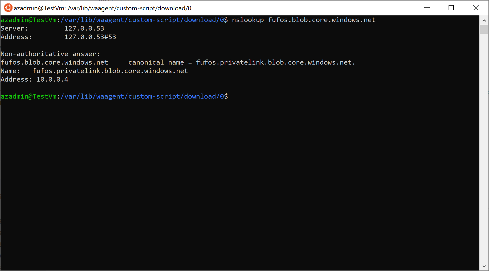

# Connecting to a storage account via a Private Endpoint #

[](https://portal.azure.com/#create/Microsoft.Template/uri/https%3A%2F%2Fraw.githubusercontent.com%2FAzure%2Fazure-quickstart-templates%2Fmaster%2F201-blob-storage-private-endpoint%2Fazuredeploy.json)
[](https://portal.azure.us/#create/Microsoft.Template/uri/https%3A%2F%2Fraw.githubusercontent.com%2FAzure%2Fazure-quickstart-templates%2Fmaster%2F201-blob-storage-private-endpoint%2Fazuredeploy.json)
[](http://armviz.io/#/?load=https%3A%2F%2Fraw.githubusercontent.com%2FAzure%2Fazure-quickstart-templates%2Fmaster%2F201-blob-storage-private-endpoint%2Fazuredeploy.json)

This sample demonstrates how to create a Linux Virtual Machine in a virtual network that privately accesses a blob storage account using an [Azure Private Endpoint](https://docs.microsoft.com/en-us/azure/private-link/private-endpoint-overview). Azure Private Endpoint is a network interface that connects you privately and securely to a service powered by Azure Private Link. Private Endpoint uses a private IP address from your virtual network, effectively bringing the service into your virtual network. The service could be an Azure service such as Azure Storage, Azure Cosmos DB, SQL, etc. or your own Private Link Service. For more information, see [What is Azure Private Link?](https://docs.microsoft.com/en-us/azure/private-link/private-link-overview). For more information on the DNS configuration of a private endpoint, see [Azure Private Endpoint DNS configuration](https://docs.microsoft.com/en-us/azure/private-link/private-endpoint-dns).

## Architecture ##

The following picture shows the architecture and network topology of the sample.



The ARM template deploys the following resources:

- Virtual Network: this virtual network has a single subnet that hosts an Linux (Ubuntu) virtual machine
- Network Security Group: this resource contains an inbound rule to allow the access to the virtual machine on port 22 (SSH)
- The virtual machine is created with a managed identity which is assigned the contributor role at the resource group scope level
- A Public IP for the Linux virtual machine
- The NIC used by the Linux virtual machine that makes use of the Public IP
- A Linux virtual machine used for testing the connectivity to the storage account via a private endpoint
- A Log Analytics workspace used to monitor the health status of the Linux virtual machine
- An Azure Data Lake Storage (ADLS) Gen 2 storage account used to store data on the Azure Data Lake File System
- An Azure Data Lake Storage (ADLS) Gen 2 storage account used to store the boot diagnostics logs of the virtual machine as blobs
- A Private DNS Zone for Azure Data Lake File System Gen2 (privatelink.dfs.core.windows.net)
- A Private DNS Zone Blob Storage Accounts (privatelink.blob.core.windows.net)
- A Private Endpoint to let the virtual machine access the Azure Data Lake File System via a private address
- A Private Endpoint to let the virtual machine store boot diagnostics logs to the second storage account via a private address

The two storage accounts are accessed via a different endpoint, hence their private endpoints need different private DNS zone:

| Storage Service | Zone Name |
| :-- | :--|
| Blob service | privatelink.blob.core.windows.net |
| Data Lake Storage Gen2 | privatelink.dfs.core.windows.net |

For more information, see [Use private endpoints for Azure Storage](https://docs.microsoft.com/en-us/azure/storage/common/storage-private-endpoints#dns-changes-for-private-endpoints).

The ARM template uses the [Azure Custom Script Extension](https://docs.microsoft.com/en-us/azure/virtual-machines/extensions/custom-script-linux) to download and run the following Bash script on the virtual machine. The script performs the following steps:

- Validates the parameters received by the Custom Script extension
- Updates the system and upgrades packages
- Installs curl and traceroute packages
- Runs the nslookup command against the public URL of the ADLS Gen 2 storage account to verify that this gets resolved to a private address
- Runs the nslookup command against the public URL of the second storage account to verify that this gets resolved to a private address
- Downloads and installs the Azure CLI
- Logins using the system-assigned managed identity of the virtual machine
- Creates a file system in the ADLS Gen 2 storage account
- Creates a directory in the file system
- Creates a file in the directory with the content passed as a parameter

```bash
#!/bin/bash

# Variables
adlsServicePrimaryEndpoint=$1
blobServicePrimaryEndpoint=$2
fileSystemName=$3
directoryName=$4
fileName=$5
fileContent=$6

# Parameter validation
if [[ -z $adlsServicePrimaryEndpoint ]]; then
    echo "adlsServicePrimaryEndpoint cannot be null or empty"
    exit 1
else
    echo "adlsServicePrimaryEndpoint: $adlsServicePrimaryEndpoint"
fi

if [[ -z $blobServicePrimaryEndpoint ]]; then
    echo "blobServicePrimaryEndpoint cannot be null or empty"
    exit 1
else
    echo "blobServicePrimaryEndpoint: $blobServicePrimaryEndpoint"
fi

if [[ -z $fileSystemName ]]; then
    echo "fileSystemName parameter cannot be null or empty"
    exit 1
else
    echo "fileSystemName: $fileSystemName"
fi

if [[ -z $directoryName ]]; then
    echo "directoryName parameter cannot be null or empty"
    exit 1
else
    echo "directoryName: $directoryName"
fi

if [[ -z $fileName ]]; then
    echo "fileName parameter cannot be null or empty"
    exit 1
else
    echo "fileName: $fileName"
fi

if [[ -z $fileContent ]]; then
    echo "fileContent parameter cannot be null or empty"
    exit 1
else
    echo "fileContent: $fileContent"
fi

# Extract the adls storage account name from the adls service primary endpoint
storageAccountName=$(echo "$adlsServicePrimaryEndpoint" | awk -F'.' '{print $1}')

if [[ -z $storageAccountName ]]; then
    echo "storageAccountName cannot be null or empty"
    exit 1
else
    echo "storageAccountName: $storageAccountName"
fi

# Eliminate debconf: warnings
echo 'debconf debconf/frontend select Noninteractive' | debconf-set-selections

# Update the system
sudo apt-get update -y

# Upgrade packages
sudo apt-get upgrade -y

# Install curl and traceroute
sudo apt install -y curl traceroute

# Install Azure CLI
curl -sL https://aka.ms/InstallAzureCLIDeb | sudo bash

# Run nslookup to verify that the <storage-account>.dfs.core.windows.net public hostname of the storage account 
# is properly mapped to <storage-account>.privatelink.dfs.core.windows.net by the privatelink.dfs.core.windows.net 
# private DNS zone and the latter is resolved to the private address by the A record
nslookup $adlsServicePrimaryEndpoint

# Run nslookup to verify that the <storage-account>.blob.core.windows.net public hostname of the storage account 
# is properly mapped to <storage-account>.privatelink.blob.core.windows.net by the privatelink.blob.core.windows.net 
# private DNS zone and the latter is resolved to the private address by the A record
nslookup $blobServicePrimaryEndpoint

# Login using the virtual machine system-assigned managed identity
az login --identity

# Create file system for the Azure Data Lake Storage Gen2 account
az storage fs create \
    --name $fileSystemName \
    --account-name $storageAccountName

# Create a directory in the ADLS Gen2 file system
az storage fs directory create \
    --file-system $fileSystemName \
    --name $directoryName \
    --account-name $storageAccountName

# Create a file to upload to the ADLS Gen2 file system in the storage account
echo $fileContent > $fileName

# Upload the file to a file path in ADLS Gen2 file system.
az storage fs file upload \
    --file-system $fileSystemName \
    --path "$directoryName/$fileName" \
    --source "./$fileName" \
    --account-name $storageAccountName

# List files and directories in the directory in the ADLS Gen2 file system.
az storage fs file list \
    --file-system $fileSystemName \
    --path $directoryName \
    --account-name $storageAccountName
```

## Deployment ##

You can use the template.json ARM template and parameters.json file included in this repository to deploy the sample. Make sure to edit the parameters.json file to customize the installation. You can also use the deploy.sh Bash script under the scripts folder to deploy the ARM template. The following figure shows the resources deployed by the ARM template in the target resource group.



## Testing ##

if you open an ssh session to the Linux virtual machine and manually run the nslookup command, you should see an output like the following:


